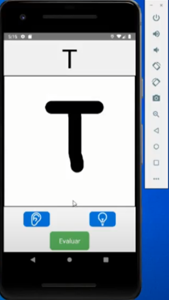

<h2>Project description</h2>

Mobile application developed in reac native with the aim of helping to combat illiteracy by teaching words to the user and correcting the writing by a neural network.

  
<h2>Functioning</h2>

  

  

  

  
<h2>Video</h2>
 
<a href="https://youtu.be/Ldv6KjhBYRw">LINK</a>
